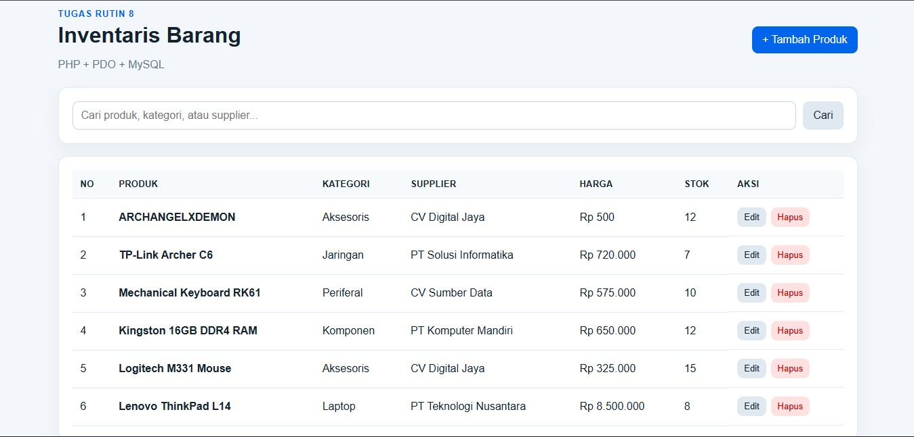
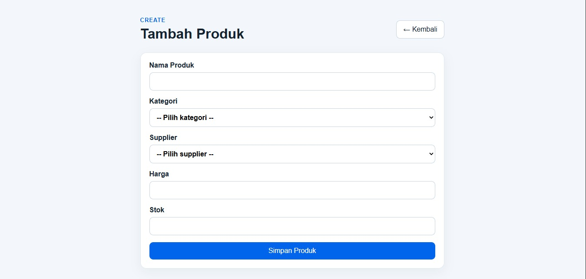
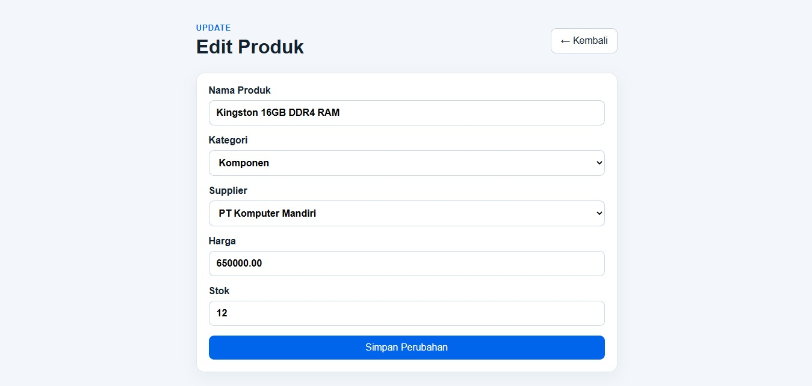
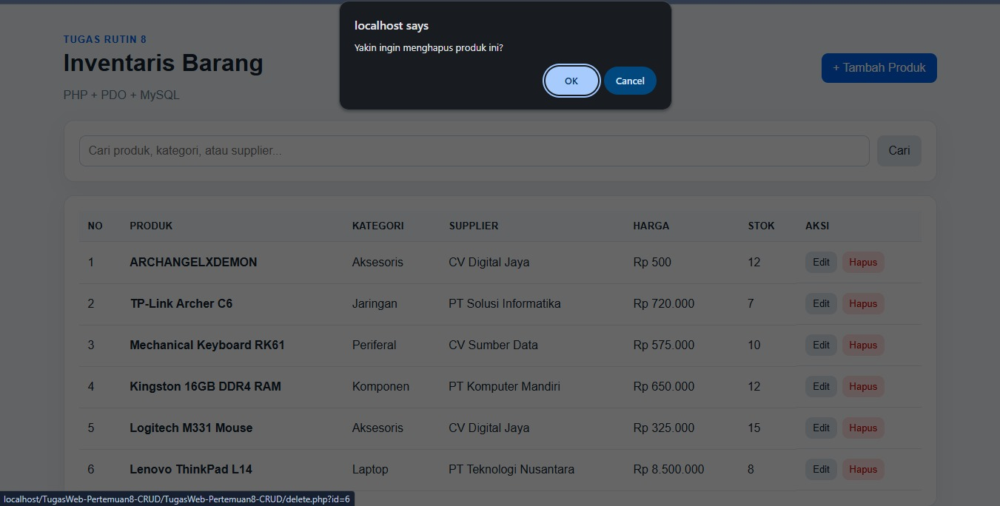
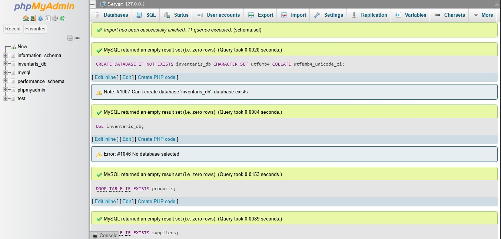

# TugasWeb-Pertemuan8-CRUD

## Tugas Rutin 8 - CRUD Inventaris Barang

Aplikasi CRUD (Create, Read, Update, Delete) untuk mengelola data inventaris barang menggunakan PHP, PDO, dan MySQL.

### Teknologi

- PHP
- PDO
- MySQL
- HTML
- CSS
- XAMPP

## Fitur Aplikasi

- **Create**: Menambahkan data produk.
- **Read**: Menampilkan daftar produk.
- **Update**: Mengubah data produk.
- **Delete**: Menghapus data produk dengan konfirmasi.
- **Search**: Mencari produk berdasarkan nama produk, kategori, atau supplier.
- Relasi database menggunakan Primary Key dan Foreign Key.
- Query input pengguna menggunakan PDO Prepared Statement.
- Output data menggunakan `htmlspecialchars()`.
- Flash message untuk hasil operasi CRUD.

## Struktur Database

Database yang digunakan adalah:

```text
inventaris_db
├── categories
├── suppliers
└── products
```

Tabel `products` berelasi dengan:

- `categories` melalui `category_id`
- `suppliers` melalui `supplier_id`

Database juga dilengkapi data awal untuk pengujian aplikasi.

## Struktur Folder

```text
TugasWeb-Pertemuan8-CRUD/
├── assets/
│   └── style.css
├── config/
│   └── database.php
├── screenshot/
├── create.php
├── delete.php
├── edit.php
├── index.php
├── schema.sql
└── README.md
```

## Cara Menjalankan Aplikasi

### 1. Jalankan XAMPP

Aktifkan:

```text
Apache
MySQL
```

### 2. Letakkan project

Salin folder project ke:

```text
C:\xampp\htdocs\TugasWeb-Pertemuan8-CRUD\
```

### 3. Import database

Buka:

```text
http://localhost/phpmyadmin
```

Kemudian:

1. Pilih menu **Import**.
2. Pilih file `schema.sql`.
3. Jalankan proses import.
4. Pastikan database `inventaris_db` berhasil dibuat.
5. Pastikan terdapat tabel `categories`, `suppliers`, dan `products`.

### 4. Jalankan aplikasi

Buka:

```text
http://localhost/TugasWeb-Pertemuan8-CRUD/
```

## Screenshot Aplikasi

### 1. Halaman Utama / Read

Menampilkan daftar produk beserta kategori, supplier, harga, stok, dan aksi CRUD.



### 2. Tambah Produk / Create

Form untuk menambahkan produk baru dengan pilihan kategori dan supplier.



### 3. Edit Produk / Update

Form edit dengan data produk yang sudah terisi.



### 4. Konfirmasi Hapus / Delete

Konfirmasi sebelum data produk dihapus.



### 5. Import Database

Proses import `schema.sql` menggunakan phpMyAdmin.



## Keamanan

Project menerapkan:

- PDO untuk koneksi database.
- Prepared Statement untuk query yang menerima input pengguna.
- `htmlspecialchars()` untuk output HTML.
- Validasi input form.
- Konfirmasi sebelum penghapusan data.

## Catatan

Aplikasi dijalankan melalui **XAMPP/localhost** karena menggunakan PHP dan MySQL. GitHub digunakan untuk menyimpan source code dan pengumpulan tugas.

### Repository GitHub

https://github.com/AsterixSilva/TugasWeb-Pertemuan8-CRUD

---

**Tugas Rutin 8 - Pemrograman Web**
